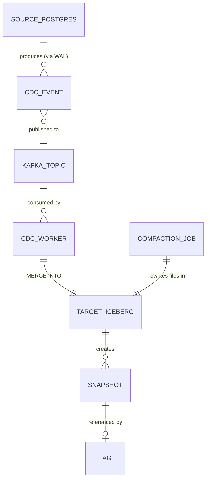

# Data Model: CDC Pipeline & Iceberg Compaction

**Feature**: 001-cdc-pipeline-compaction  
**Date**: 2026-04-04

## Entities

### 1. Source Database Table: `customers`

The sample table used to demonstrate the full CDC flow.

| Field        | Type           | Constraints    | Notes                              |
|-------------|----------------|----------------|------------------------------------|
| `id`        | SERIAL (INT)   | PRIMARY KEY    | Auto-incrementing, used as CDC key |
| `name`      | VARCHAR(255)   | NOT NULL       | Customer full name                 |
| `email`     | VARCHAR(255)   | UNIQUE         | Contact email                      |
| `status`    | VARCHAR(50)    | DEFAULT 'active' | active / inactive / suspended    |
| `created_at`| TIMESTAMP      | DEFAULT NOW()  | Row creation time                  |
| `updated_at`| TIMESTAMP      | DEFAULT NOW()  | Last modification time             |

**Seed data**: 10 sample rows inserted by `init.sql`.

### 2. Debezium CDC Event (Kafka Message)

The envelope format produced by Debezium's PostgreSQL connector.

| Field            | Type    | Description                                              |
|-----------------|---------|----------------------------------------------------------|
| `schema`        | Object  | Avro/JSON schema metadata (ignored by cdc-worker)        |
| `payload.op`    | String  | Operation type: `c` (create), `u` (update), `d` (delete), `r` (read/snapshot) |
| `payload.before`| Object  | Row state before the change (present for `u`, `d`)       |
| `payload.after` | Object  | Row state after the change (present for `c`, `u`, `r`)   |
| `payload.source`| Object  | Source metadata: `ts_ms`, `db`, `schema`, `table`, `lsn` |
| `payload.ts_ms` | Long    | Debezium event timestamp (milliseconds since epoch)      |

**Key behaviors**:
- For `c` (INSERT) and `r` (snapshot): use `after` image
- For `u` (UPDATE): use `after` image (latest values)
- For `d` (DELETE): use `before` image to identify the PK, then delete

### 3. Target Iceberg Table: `iceberg.{namespace}.customers`

The CDC mirror table in the lakehouse.

| Field        | Iceberg Type | Nullable | Notes                                    |
|-------------|-------------|----------|------------------------------------------|
| `id`        | INT         | false    | Primary key (identity field for MERGE)    |
| `name`      | STRING      | false    | Synced from source                        |
| `email`     | STRING      | true     | Synced from source                        |
| `status`    | STRING      | true     | Synced from source                        |
| `created_at`| TIMESTAMP   | true     | Synced from source                        |
| `updated_at`| TIMESTAMP   | true     | Synced from source                        |
| `_cdc_op`   | STRING      | true     | Last CDC operation (c/u/d) — audit trail  |
| `_cdc_ts`   | LONG        | true     | Debezium event timestamp — audit trail    |

**Table properties**:
- `format-version`: 2 (required for row-level deletes)
- `write.merge.mode`: merge-on-read (MoR)
- `write.delete.mode`: merge-on-read
- `write.update.mode`: merge-on-read

### 4. Compaction Job Metadata

| Field            | Type    | Description                                    |
|-----------------|---------|------------------------------------------------|
| `target_table`  | String  | Fully-qualified Iceberg table name             |
| `strategy`      | String  | `bin-pack` (default) or `sort`                 |
| `target_file_size_bytes` | Long | Target file size (default: 128 MiB) |
| `files_rewritten`| Int    | Number of files rewritten in this run          |
| `files_added`   | Int     | Number of new files created                    |
| `status`        | String  | COMPLETED / FAILED                             |

### 5. Snapshot Tag

| Field         | Type    | Description                                      |
|--------------|---------|--------------------------------------------------|
| `tag_name`   | String  | User-defined label (e.g., `training-2026-Q1`)    |
| `snapshot_id`| Long    | Iceberg snapshot ID the tag references            |
| `table_name` | String  | Fully-qualified Iceberg table name               |
| `retain_days`| Integer | Optional retention period (null = forever)       |

## State Transitions

### CDC Job Lifecycle

```
STARTING → RUNNING → STOPPED
                   ↘ FAILED
```

- `STARTING`: SparkSession initializing, Kafka consumer connecting
- `RUNNING`: Actively processing micro-batches from Kafka
- `STOPPED`: Graceful shutdown via shutdown hook
- `FAILED`: Unrecoverable error (e.g., Kafka unreachable, Iceberg catalog down)

### Compaction Job Lifecycle

```
PENDING → PROCESSING → COMPLETED
                     ↘ FAILED
```

Uses the same lifecycle as existing ingestion/query jobs.

## Relationships



## Validation Rules

1. **Primary key (`id`)**: Must be non-null in all CDC events. Events without a valid PK are logged and skipped.
2. **Operation type (`op`)**: Must be one of `c`, `u`, `d`, `r`. Unknown operations are logged and skipped.
3. **Deduplication**: Within a micro-batch, if multiple events share the same PK, only the event with the highest Kafka offset is retained.
4. **Tag names**: Must be non-empty strings matching `[a-zA-Z0-9_-]+`. Names with invalid characters are rejected.
5. **Snapshot IDs for tagging**: Must reference an existing, non-expired snapshot. Tagging an expired/non-existent snapshot returns an error.
