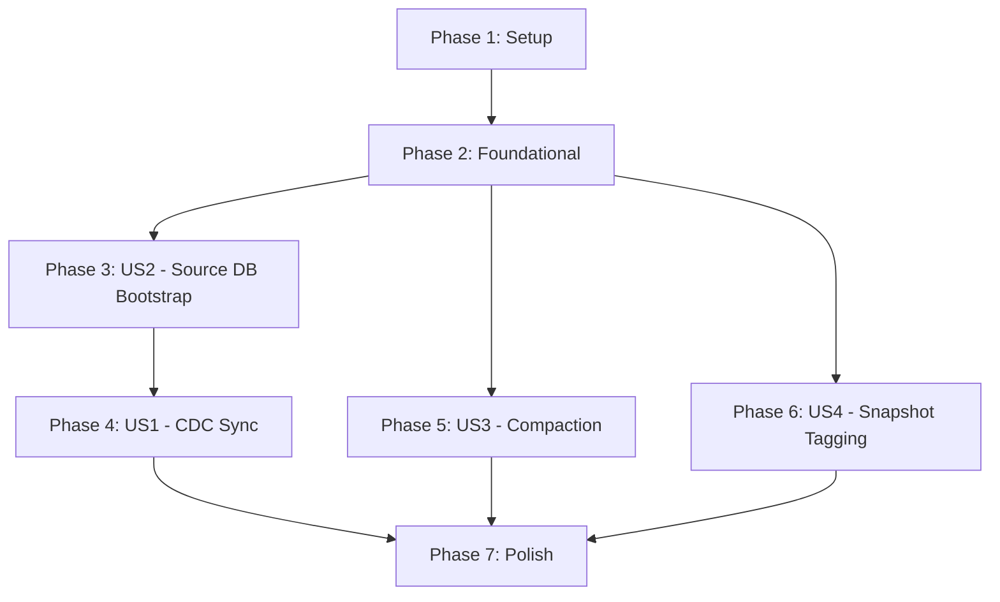

# Tasks: CDC Pipeline & Iceberg Compaction

**Input**: Design documents from `/specs/001-cdc-pipeline-compaction/`
**Prerequisites**: plan.md (required), spec.md (required), research.md, data-model.md, contracts/

## Format: `[ID] [P?] [Story] Description`

- **[P]**: Can run in parallel (different files, no dependencies)
- **[Story]**: Which user story this task belongs to (e.g., US1, US2, US3, US4)
- Include exact file paths in descriptions

## User Story Mapping

| Story | Spec Priority | Title | Phase |
|-------|--------------|-------|-------|
| US1 | P1 | Real-Time Database-to-Lakehouse Sync | Phase 4 |
| US2 | P1 | Source Database Bootstrapping | Phase 3 |
| US3 | P2 | Iceberg Table Compaction | Phase 5 |
| US4 | P3 | Snapshot Tagging for ML Training | Phase 6 |

> US2 is placed before US1 because US1 (the CDC pipeline) has a hard dependency on US2 (a working source database). US2 is the foundational infrastructure prerequisite.

---

## Phase 1: Setup (Shared Infrastructure)

**Purpose**: Create the cdc-worker project structure and shared build files

- [x] T001 Create cdc-worker Maven project with pom.xml mirroring ingestion-worker dependencies (Spark 3.5, Iceberg, Kafka client, Lettuce, Jackson) in `cdc-worker/pom.xml`
- [x] T002 [P] Create cdc-worker Dockerfile with multi-stage Spark base image in `cdc-worker/Dockerfile`
- [x] T003 [P] Create CdcConfig class for centralized environment variable loading in `cdc-worker/src/main/java/com/abdelwahab/cdc_worker/config/CdcConfig.java`
- [x] T004 [P] Create source-db directory with init.sql placeholder in `source-db/init.sql`

---

## Phase 2: Foundational (Blocking Prerequisites)

**Purpose**: Add Kafka, source-postgres, and Debezium infrastructure to docker-compose + wire up the cdc-worker skeleton

**⚠️ CRITICAL**: No user story work can begin until this phase is complete

- [x] T005 Add source-postgres service to `docker-compose.yml` with wal_level=logical, max_replication_slots=4, max_wal_senders=4 via command args, mounting `source-db/init.sql` as `/docker-entrypoint-initdb.d/init.sql`, named volume for persistence
- [x] T006 Add kafka service (KRaft mode, single node, no Zookeeper) to `docker-compose.yml` with internal listener on port 29092 and external on 9092
- [x] T007 Add debezium-connect service (debezium/connect image) to `docker-compose.yml` depending on kafka and source-postgres, exposing port 8083
- [x] T008 Add cdc-worker service to `docker-compose.yml` depending on kafka, debezium-connect, iceberg-rest, minio, and redis with all required environment variables
- [x] T009 Add all new environment variables (SOURCE_POSTGRES_*, KAFKA_*, CDC_*, COMPACTION_*, SNAPSHOT_*) to `.env`
- [x] T010 Create StorageConfigurer class (reusing pattern from ingestion-worker) to configure S3/MinIO on SparkSession in `cdc-worker/src/main/java/com/abdelwahab/cdc_worker/storage/StorageConfigurer.java`
- [x] T011 [P] Create CdcEngine interface with init/start/stop lifecycle methods in `cdc-worker/src/main/java/com/abdelwahab/cdc_worker/engine/CdcEngine.java`
- [x] T012 [P] Create CdcEngineFactory to select engine based on CDC_ENGINE env var in `cdc-worker/src/main/java/com/abdelwahab/cdc_worker/engine/CdcEngineFactory.java`
- [x] T013 [P] Create StreamReader interface in `cdc-worker/src/main/java/com/abdelwahab/cdc_worker/consumer/StreamReader.java`
- [x] T014 Create AsyncRedisJobStatusService (adapted from ingestion-worker) in `cdc-worker/src/main/java/com/abdelwahab/cdc_worker/status/redis/AsyncRedisJobStatusService.java`
- [x] T015 Create CdcWorkerMain entry point with factory wiring, shutdown hooks, and main thread blocking in `cdc-worker/src/main/java/com/abdelwahab/cdc_worker/CdcWorkerMain.java`

**Checkpoint**: Infrastructure is in place — `docker compose up` should start all containers (source-postgres, kafka, debezium-connect, cdc-worker skeleton). cdc-worker starts but does not process events yet.

---

## Phase 3: User Story 2 — Source Database Bootstrapping (Priority: P1) 🎯 MVP-Prerequisite

**Goal**: Automatically provision a source PostgreSQL database with sample data, logical replication, and CDC-ready configuration on first platform startup.

**Independent Test**: Start the platform from a clean state (`docker compose up`), connect to source-postgres, verify the `customers` table exists with 10 seed rows, and confirm `wal_level=logical` via `SHOW wal_level`.

### Implementation for User Story 2

- [x] T016 [US2] Write init.sql with DDL for `customers` table (id SERIAL PK, name, email, status, created_at, updated_at), granting REPLICATION to the debezium user, and creating the `dbz_publication FOR ALL TABLES` in `source-db/init.sql`
- [x] T017 [US2] Add 10 seed INSERT rows to init.sql for realistic sample data with varied statuses in `source-db/init.sql`
- [x] T018 [US2] Create a Debezium connector registration script or init container that POSTs the connector config JSON to `http://debezium-connect:8083/connectors` on startup — implement as `source-db/register-connector.sh` and add an init service to `docker-compose.yml`
- [x] T019 [US2] Verify end-to-end: source-postgres healthy, customers table has 10 rows, wal_level=logical, Debezium connector RUNNING, Kafka topic `cdc.public.customers` exists with snapshot events

**Checkpoint**: Source database is fully provisioned. Debezium is capturing changes and emitting CDC events to Kafka. Ready for cdc-worker consumption.

---

## Phase 4: User Story 1 — Real-Time Database-to-Lakehouse Sync (Priority: P1) 🎯 MVP

**Goal**: The cdc-worker continuously consumes CDC events from Kafka, deduplicates by primary key, and applies UPSERT/DELETE via Iceberg MERGE INTO — syncing the source database to the lakehouse Iceberg table.

**Independent Test**: Insert, update, and delete rows in source-postgres, then query the target Iceberg table via the existing API to confirm all changes are reflected accurately within 30 seconds.

### Implementation for User Story 1

- [x] T020 [P] [US1] Implement KafkaStreamReader that reads from the CDC Kafka topic with JSON deserialization and returns a streaming DataFrame in `cdc-worker/src/main/java/com/abdelwahab/cdc_worker/consumer/kafka/KafkaStreamReader.java`
- [x] T021 [P] [US1] Implement DebeziumEventParser that extracts `payload.op`, `payload.before`, `payload.after`, and `payload.ts_ms` from the raw Kafka JSON value and flattens into a structured DataFrame with columns (id, name, email, status, created_at, updated_at, _cdc_op, _cdc_ts) in `cdc-worker/src/main/java/com/abdelwahab/cdc_worker/engine/spark/DebeziumEventParser.java`
- [x] T022 [US1] Implement EventDeduplicator that within a micro-batch DataFrame, partitions by primary key (id), orders by _cdc_ts DESC (or Kafka offset), and keeps only the latest event per key using a window function in `cdc-worker/src/main/java/com/abdelwahab/cdc_worker/engine/spark/EventDeduplicator.java`
- [x] T023 [US1] Implement IcebergMergeWriter with the foreachBatch callback that: (1) creates the target Iceberg table if not exists (format-version=2, MoR properties), (2) registers the micro-batch as a temp view, (3) executes MERGE INTO with DELETE for op='d', UPDATE SET for op IN ('c','u','r') WHEN MATCHED, INSERT for WHEN NOT MATCHED, using broadcast hint on the batch, in `cdc-worker/src/main/java/com/abdelwahab/cdc_worker/engine/spark/IcebergMergeWriter.java`
- [x] T024 [US1] Implement SparkCdcEngine that creates the SparkSession with Iceberg catalog config (matching query-worker's disabling of CachingCatalog), runs warm-up SELECT 1, and exposes session lifecycle in `cdc-worker/src/main/java/com/abdelwahab/cdc_worker/engine/spark/SparkCdcEngine.java`
- [x] T025 [US1] Implement CdcStreamProcessor that orchestrates the pipeline: KafkaStreamReader.read() → DebeziumEventParser.parse() → EventDeduplicator.deduplicate() → IcebergMergeWriter.write(), configuring the streaming query with ProcessingTime trigger (from CDC_TRIGGER_INTERVAL), checkpoint location (CDC_CHECKPOINT_DIR on S3), and awaitTermination in `cdc-worker/src/main/java/com/abdelwahab/cdc_worker/engine/spark/CdcStreamProcessor.java`
- [x] T026 [US1] Wire SparkCdcEngine into CdcEngineFactory and update CdcWorkerMain to call engine.start() which delegates to CdcStreamProcessor in `cdc-worker/src/main/java/com/abdelwahab/cdc_worker/engine/CdcEngineFactory.java` and `cdc-worker/src/main/java/com/abdelwahab/cdc_worker/CdcWorkerMain.java`
- [x] T027 [US1] Add error handling: wrap foreachBatch in try/catch that writes FAILED status to Redis on unrecoverable errors, add shutdown hook to stop the streaming query gracefully in `cdc-worker/src/main/java/com/abdelwahab/cdc_worker/engine/spark/CdcStreamProcessor.java`
- [x] T028 [US1] End-to-end verification: (1) `docker compose up`, wait for cdc-worker to start, (2) verify initial snapshot — all 10 seed rows in Iceberg, (3) INSERT a new row in source-postgres, verify it appears in Iceberg within 30s, (4) UPDATE a row, verify updated values, (5) DELETE a row, verify it's gone from Iceberg

**Checkpoint**: Full CDC pipeline is working. INSERT/UPDATE/DELETE changes flow from source-postgres → Debezium → Kafka → cdc-worker → Iceberg table automatically.

---

## Phase 5: User Story 3 — Iceberg Table Compaction (Priority: P2)

**Goal**: Provide a compaction mechanism that rewrites small data files into fewer, larger files using Iceberg's RewriteDataFiles action with bin-pack strategy.

**Independent Test**: After the CDC pipeline has created many small files from micro-batches, run the compaction job and verify the file count is reduced by 50%+ while all rows remain intact.

### Implementation for User Story 3

- [x] T029 [US3] Implement CompactionService with a `compact(String tableName, long targetFileSizeBytes)` method that uses `SparkActions.get(spark).rewriteDataFiles(table)` with bin-pack strategy, min-input-files=2, and returns a result object with files rewritten/added counts in `cdc-worker/src/main/java/com/abdelwahab/cdc_worker/maintenance/CompactionService.java`
- [x] T030 [US3] Add compaction status reporting: before compaction write PROCESSING to Redis, after success write COMPLETED with file stats, on failure write FAILED with error message in `cdc-worker/src/main/java/com/abdelwahab/cdc_worker/maintenance/CompactionService.java`
- [x] T031 [US3] Add a CLI trigger mechanism: if CdcWorkerMain receives a `--compact <tableName>` argument, run CompactionService.compact() instead of the streaming pipeline, then exit in `cdc-worker/src/main/java/com/abdelwahab/cdc_worker/CdcWorkerMain.java`
- [x] T032 [US3] Verify compaction: run the CDC pipeline for 5+ micro-batches to create small files, execute `docker compose run cdc-worker --compact iceberg.cdc_namespace.customers`, confirm file count reduced and row count unchanged

**Checkpoint**: Compaction is available as a maintenance operation. Can be triggered manually or scheduled via cron.

---

## Phase 6: User Story 4 — Snapshot Tagging for ML Training (Priority: P3)

**Goal**: Enable creating named tags on Iceberg snapshots to protect them from expiration, and provide snapshot expiration that respects tagged snapshots.

**Independent Test**: Tag a snapshot, run expire snapshots, verify the tagged snapshot survives while untagged old snapshots are removed.

### Implementation for User Story 4

- [x] T033 [P] [US4] Implement SnapshotManager with `createTag(String tableName, String tagName, Long snapshotId, Integer retainDays)` that executes `ALTER TABLE ... CREATE TAG tagName AS OF VERSION snapshotId [RETAIN N DAYS]` via Spark SQL in `cdc-worker/src/main/java/com/abdelwahab/cdc_worker/maintenance/SnapshotManager.java`
- [x] T034 [P] [US4] Add `expireSnapshots(String tableName, long retainMillis)` to SnapshotManager that uses `SparkActions.get(spark).expireSnapshots(table).expireOlderThan(timestamp).execute()` — tagged snapshots are automatically preserved by Iceberg in `cdc-worker/src/main/java/com/abdelwahab/cdc_worker/maintenance/SnapshotManager.java`
- [x] T035 [US4] Add CLI triggers: `--tag <tableName> <tagName> [snapshotId]` and `--expire-snapshots <tableName> [retainDays]` arguments to CdcWorkerMain that invoke SnapshotManager methods, then exit in `cdc-worker/src/main/java/com/abdelwahab/cdc_worker/CdcWorkerMain.java`
- [x] T036 [US4] Add input validation in SnapshotManager: validate tag names match `[a-zA-Z0-9_-]+`, verify snapshot ID exists before tagging, handle and log errors for expired/non-existent snapshots in `cdc-worker/src/main/java/com/abdelwahab/cdc_worker/maintenance/SnapshotManager.java`
- [x] T037 [US4] Verify snapshot tagging: (1) run CDC pipeline to create multiple snapshots, (2) tag one snapshot via `docker compose run cdc-worker --tag iceberg.cdc_namespace.customers training-v1`, (3) run `docker compose run cdc-worker --expire-snapshots iceberg.cdc_namespace.customers 0`, (4) confirm tagged snapshot still exists and queryable via `SELECT * FROM iceberg.cdc_namespace.customers.tag_training-v1`

**Checkpoint**: Snapshot tagging and expiration are fully functional. Tagged snapshots survive expiration cleanup.

---

## Phase 7: Polish & Cross-Cutting Concerns

**Purpose**: Documentation, logging consistency, and final validation

- [x] T038 [P] Update README.md with new architecture diagram showing Kafka, Debezium, source-postgres, and cdc-worker services in `README.md`
- [x] T039 [P] Update quickstart.md with verified commands and outputs from end-to-end testing in `specs/001-cdc-pipeline-compaction/quickstart.md`
- [x] T040 Add structured logging (SLF4J + Logback) consistent with existing workers across all cdc-worker classes — ensure log levels (INFO for lifecycle, DEBUG for per-batch, ERROR for failures) in all `cdc-worker/src/main/java/com/abdelwahab/cdc_worker/**/*.java`
- [x] T041 Add Javadoc documentation matching the existing codebase style (class-level doc with design rationale, method-level doc with param/return) to all new classes in `cdc-worker/src/main/java/com/abdelwahab/cdc_worker/**/*.java`
- [x] T042 Run full end-to-end validation: `docker compose down -v && docker compose up`, verify all 8 success criteria from spec.md (SC-001 through SC-008)

---

## Dependencies & Execution Order

### Phase Dependencies

- **Setup (Phase 1)**: No dependencies — can start immediately
- **Foundational (Phase 2)**: Depends on Phase 1 — BLOCKS all user stories
- **US2 — Source DB Bootstrapping (Phase 3)**: Depends on Phase 2 — BLOCKS US1 (CDC pipeline needs a working source DB)
- **US1 — CDC Sync (Phase 4)**: Depends on Phase 3 (source DB + Debezium must be running)
- **US3 — Compaction (Phase 5)**: Depends on Phase 2 (needs Spark engine) — can run in parallel with US1 if Spark session is shared, but logically tested after US1
- **US4 — Snapshot Tagging (Phase 6)**: Depends on Phase 2 (needs Spark engine) — independent of US1/US3
- **Polish (Phase 7)**: Depends on all user stories being complete

### User Story Dependencies



### Within Each User Story

- Models/entities before services
- Services before orchestrators
- Core implementation before error handling
- Verification as final task

### Parallel Opportunities

- T002, T003, T004 can run in parallel (Phase 1 — different files)
- T011, T012, T013 can run in parallel (Phase 2 — interfaces, no dependencies)
- T020, T021 can run in parallel (Phase 4 — reader and parser are independent)
- T033, T034 can run in parallel (Phase 6 — create tag and expire are independent methods)
- T038, T039 can run in parallel (Phase 7 — different documentation files)
- US3 and US4 can run in parallel (different maintenance features, no shared state)

---

## Parallel Example: User Story 1

```bash
# Launch reader and parser in parallel (different files, no dependencies):
Task: "KafkaStreamReader in consumer/kafka/KafkaStreamReader.java"
Task: "DebeziumEventParser in engine/spark/DebeziumEventParser.java"

# Then sequentially:
Task: "EventDeduplicator (depends on parser output schema)"
Task: "IcebergMergeWriter (depends on deduplicator output)"
Task: "CdcStreamProcessor (orchestrates all above)"
Task: "Wire into CdcWorkerMain"
```

---

## Implementation Strategy

### MVP First (US2 + US1 Only)

1. Complete Phase 1: Setup → cdc-worker project skeleton
2. Complete Phase 2: Foundational → docker-compose with all infrastructure
3. Complete Phase 3: US2 → Source database provisioned and Debezium capturing
4. Complete Phase 4: US1 → Full CDC pipeline active
5. **STOP and VALIDATE**: INSERT/UPDATE/DELETE flow end-to-end ← This is the MVP!

### Incremental Delivery

1. Setup + Foundational → Infrastructure ready
2. US2 (Source DB) → Database bootstrapping works → Partial demo
3. US1 (CDC Sync) → Full pipeline working → **MVP Demo!**
4. US3 (Compaction) → Maintenance available → Enhanced demo
5. US4 (Tagging) → ML workflow support → Complete feature
6. Polish → Documentation, logging, final validation

### Suggested MVP Scope

**US2 + US1 = 28 tasks** — This delivers the complete CDC pipeline with source database bootstrapping. Compaction (US3) and Tagging (US4) can follow as incremental additions.

---

## Notes

- [P] tasks = different files, no dependencies
- [Story] label maps task to specific user story for traceability
- Each user story should be independently completable and testable
- Commit after each task or logical group
- Stop at any checkpoint to validate story independently
- US2 (Source DB) is placed before US1 (CDC Sync) despite both being P1, because US1 has a hard dependency on US2
