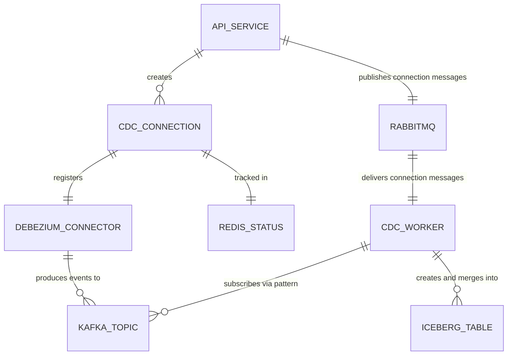

# Data Model: Dynamic API-Driven CDC Connectivity

**Feature**: 002-dynamic-cdc-api  
**Date**: 2026-04-05

## Entities

### 1. CDC Connection Request (API Input)

The JSON body accepted by `POST /api/v1/cdc/connections`.

| Field        | Type        | Required | Constraints              | Notes                              |
|-------------|-------------|----------|--------------------------|--------------------------------------|
| `host`      | String      | ✅       | Valid hostname/IP          | Source DB hostname                   |
| `port`      | Integer     | ❌       | 1-65535, default: 5432     | Source DB port                       |
| `database`  | String      | ✅       | Non-blank                  | Source DB name                       |
| `schema`    | String      | ❌       | Default: `public`          | Source DB schema                     |
| `table`     | String      | ✅       | Non-blank                  | Source table name                    |
| `username`  | String      | ✅       | Non-blank                  | DB user with replication privilege   |
| `password`  | String      | ✅       | Non-blank                  | DB password (never logged/returned)  |

**Validation rules**:
- `host` must be reachable (validated via JDBC connection attempt)
- Source DB must have `wal_level=logical`
- Target table must exist in the source DB
- Target table must have a primary key

### 2. CDC Connection (Redis Hash)

Stored in Redis as `cdc-conn:{connectionId}` hash.

| Field             | Type    | Description                                                |
|------------------|---------|------------------------------------------------------------|
| `connectionId`   | String  | UUID, auto-generated                                       |
| `status`         | String  | Current state (see state machine in research.md)           |
| `sourceHost`     | String  | Source DB hostname                                         |
| `sourcePort`     | Integer | Source DB port                                             |
| `sourceDatabase` | String  | Source DB name                                             |
| `sourceSchema`   | String  | Source schema (e.g., `public`)                             |
| `sourceTable`    | String  | Source table name                                          |
| `sourceUsername`  | String  | DB username                                                |
| `sourcePassword` | String  | **Encrypted** (AES-256-GCM) — never stored plaintext       |
| `primaryKeyColumn`| String | Name of the PK column discovered via JDBC metadata        |
| `columns`        | String  | JSON array of `{name, type}` discovered via JDBC metadata  |
| `connectorName`  | String  | Debezium connector name: `cdc-conn-{connectionId}`         |
| `slotName`       | String  | PostgreSQL replication slot: `slot_{short_id}`             |
| `topicPrefix`    | String  | Kafka topic prefix for this connection (default: `cdc`)    |
| `targetTable`    | String  | Fully qualified Iceberg table: `iceberg.{ns}.{table}`      |
| `errorMessage`   | String  | Error details when status is `*_FAILED`                    |
| `createdAt`      | String  | ISO-8601 timestamp                                         |
| `updatedAt`      | String  | ISO-8601 timestamp                                         |

### 3. CDC Connection Response (API Output)

Returned by `POST /api/v1/cdc/connections`.

| Field             | Type    | Description                                          |
|------------------|---------|------------------------------------------------------|
| `connectionId`   | String  | UUID                                                 |
| `status`         | String  | Initial status: `PENDING`                            |
| `sourceTable`    | String  | `{schema}.{table}`                                   |
| `targetTable`    | String  | `iceberg.{namespace}.{table}`                        |
| `checkStatusAt`  | String  | URL: `/api/v1/cdc/connections/{connectionId}`        |
| `createdAt`      | String  | ISO-8601                                             |

**Note**: Response NEVER includes `password`, `username`, or other sensitive fields.

### 4. CDC Connection Status (API Output)

Returned by `GET /api/v1/cdc/connections/{connectionId}`.

| Field             | Type    | Description                                          |
|------------------|---------|------------------------------------------------------|
| `connectionId`   | String  | UUID                                                 |
| `status`         | String  | Current state                                        |
| `sourceHost`     | String  | Source DB hostname                                   |
| `sourceDatabase` | String  | Source DB name                                       |
| `sourceTable`    | String  | `{schema}.{table}`                                   |
| `targetTable`    | String  | `iceberg.{namespace}.{table}`                        |
| `connectorStatus`| String  | Debezium connector status (RUNNING/FAILED/UNASSIGNED)|
| `errorMessage`   | String  | Error details (null if healthy)                      |
| `createdAt`      | String  | ISO-8601                                             |
| `updatedAt`      | String  | ISO-8601                                             |

### 5. CdcConnectionMessage (RabbitMQ Message)

Published by api-service, consumed by cdc-worker.

| Field             | Type    | Description                                          |
|------------------|---------|------------------------------------------------------|
| `connectionId`   | String  | UUID                                                 |
| `action`         | String  | `CREATE` or `DELETE`                                 |
| `sourceTable`    | String  | `{schema}.{table}`                                   |
| `topicName`      | String  | Kafka topic: `cdc.{schema}.{table}`                  |
| `targetTable`    | String  | `iceberg.{namespace}.{table}`                        |
| `primaryKeyColumn`| String | PK column name for MERGE INTO                       |

### 6. Debezium Connector Config (JSON)

POSTed to `POST http://debezium-connect:8083/connectors`.

```json
{
  "name": "cdc-conn-{connectionId}",
  "config": {
    "connector.class": "io.debezium.connector.postgresql.PostgresConnector",
    "database.hostname": "{host}",
    "database.port": "{port}",
    "database.user": "{username}",
    "database.password": "{password}",
    "database.dbname": "{database}",
    "topic.prefix": "cdc",
    "table.include.list": "{schema}.{table}",
    "plugin.name": "pgoutput",
    "slot.name": "slot_{shortId}",
    "publication.autocreate.mode": "all_tables",
    "snapshot.mode": "initial",
    "tombstones.on.delete": "false",
    "key.converter": "org.apache.kafka.connect.json.JsonConverter",
    "key.converter.schemas.enable": "false",
    "value.converter": "org.apache.kafka.connect.json.JsonConverter",
    "value.converter.schemas.enable": "false"
  }
}
```

## State Transitions

### CDC Connection Lifecycle

```
PENDING → VALIDATING → REGISTERING → SNAPSHOTTING → STREAMING
               ↘              ↘              ↘            ↘
         VALIDATION_FAILED  REG_FAILED  SNAPSHOT_FAILED  STREAM_FAILED

Any state → DELETING → DELETED
```

| Transition | Trigger | Owner |
|-----------|---------|-------|
| PENDING → VALIDATING | API request received | api-service |
| VALIDATING → REGISTERING | JDBC connection test passed | api-service |
| VALIDATING → VALIDATION_FAILED | JDBC connection test failed | api-service |
| REGISTERING → SNAPSHOTTING | Debezium connector registered, message sent to worker | api-service |
| REGISTERING → REG_FAILED | Debezium REST API error | api-service |
| SNAPSHOTTING → STREAMING | Initial snapshot complete, continuous streaming begins | cdc-worker |
| SNAPSHOTTING → SNAPSHOT_FAILED | Snapshot processing error | cdc-worker |
| STREAMING → STREAM_FAILED | Processing error (may auto-recover) | cdc-worker |
| Any → DELETING | DELETE API call received | api-service |
| DELETING → DELETED | Debezium connector removed | api-service |

## Relationships



## Validation Rules

1. **Source host**: Must be resolvable and reachable (JDBC connection test).
2. **WAL level**: Source PostgreSQL must have `wal_level=logical`. Validated at connection time.
3. **Primary key**: Source table must have a primary key. Discovered via `information_schema.table_constraints`.
4. **Table existence**: Source table must exist in the specified schema. Validated via JDBC metadata.
5. **Unique connection**: At most one CDC connection per (host, port, database, schema, table) combination. Enforced via Redis lookup.
6. **Password**: Never null, never logged, never returned in API responses, encrypted before Redis storage.
7. **Connector name**: Must match `cdc-conn-{connectionId}` pattern. Max 128 characters.
8. **Slot name**: Must be unique per PostgreSQL server. Generated as `slot_{shortId}` where shortId is the first 8 chars of the connectionId.
